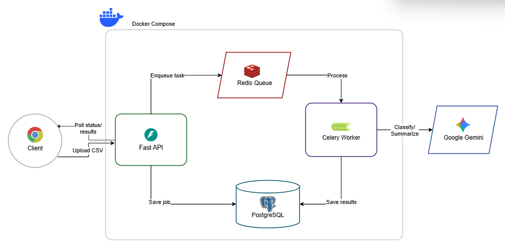

# AI Transaction Processing Pipeline

Async transaction processing system with CSV ingestion, anomaly detection, and LLM-powered categorization.

## Setup

1. Get a Gemini API key from https://aistudio.google.com/api-keys
2. Add it to `.env.defaults`:
   ```
   GEMINI_API_KEY=your_key_here
   ```
3. Start the system:
   ```bash
   docker compose up
   ```

The API will be available at http://localhost:8000/docs

## Testing

Run the included test script:
```bash
python tests/test_api.py
```

Or use curl:
```bash
# Upload CSV
curl -X POST http://localhost:8000/api/v1/jobs/upload \
  -F "file=@transactions.csv"

# Check status
curl http://localhost:8000/api/v1/jobs/{job_id}/status

# Get results
curl http://localhost:8000/api/v1/jobs/{job_id}/results

# List all jobs
curl http://localhost:8000/api/v1/jobs
```

## Architecture



The system follows an async pipeline architecture:
1. **Client** uploads CSV to FastAPI REST API
2. **FastAPI** saves job to PostgreSQL and enqueues task to Redis
3. **Celery Worker** processes in 4 steps:
   - Clean data (normalize dates, remove duplicates)
   - Detect anomalies (statistical outliers, currency mismatches)
   - LLM classification (batch calls to Gemini)
   - LLM summary (narrative generation)
4. **Results** stored in PostgreSQL, retrieved via polling API
5. **Monitoring** via Flower dashboard (port 5555)

## Data Processing

### Cleaning
- Normalize dates to ISO 8601
- Remove currency symbols from amounts
- Uppercase status and currency fields
- Fill blank categories with "Uncategorised"
- Remove duplicate rows

### Anomaly Detection
- Statistical outliers: amount > 3× account median
- Currency mismatches: non-INR on domestic merchants (Swiggy, Zomato, etc.)

### LLM Integration
- Batch classification: chunks of 30 transactions per API call
- Categories: Food, Shopping, Travel, Transport, Utilities, Entertainment, Cash Withdrawal, Uncategorised
- Summary generation: single API call returns total spend, top merchants, risk level
- Retry logic: 3 retries with exponential backoff (2s, 4s, 8s)
- If LLM fails: job marked as `llm_failed` but cleaning/anomaly results still available

## API Endpoints

### POST /api/v1/jobs/upload
Upload CSV file, returns job_id immediately.

### GET /api/v1/jobs/{job_id}/status
Check job status. Returns summary when complete.

### GET /api/v1/jobs/{job_id}/results
Get full results including all transactions, anomalies, and summary.

### GET /api/v1/jobs
List all jobs with optional status filter.

## Database Schema

**jobs**: id, original_filename, status, total_rows, cleaned_rows, duplicate_rows, anomaly_count, error_message, created_at, updated_at

**transactions**: id, job_id, txn_id, txn_date, merchant, amount, currency, status, category, account_id, notes, is_anomaly, anomaly_reason, llm_category, llm_failed

**job_summaries**: id, job_id, total_spend, top_merchants (jsonb), anomaly_count, category_breakdown (jsonb), narrative, risk_level, llm_failed

## Tech Stack

- **API**: FastAPI 0.138+ (async support for non-blocking uploads)
- **Queue**: Celery 5.6+ with Redis (task retry and monitoring)
- **Database**: PostgreSQL 18 with SQLAlchemy 2.0 async
- **Migrations**: Alembic (runs automatically on startup)
- **LLM**: Gemini 3.5 Flash (structured JSON output)
- **Monitoring**: Flower (http://localhost:5555)

## Project Structure

```
app/
├── main.py              # FastAPI app
├── core/                # Config, database, logging
├── models/              # SQLAlchemy models
├── schemas/             # Pydantic schemas
├── repositories/        # Database access layer
├── api/v1/routes/       # API endpoints
├── services/
│   ├── cleaning/        # Data normalization
│   ├── anomaly/         # Anomaly detection
│   └── llm/             # LLM provider with retry logic
├── workers/             # Celery tasks
└── migrations/          # Alembic migrations

docker/
├── api.Dockerfile       # API service
└── worker.Dockerfile    # Celery worker

tests/                   # Unit tests for cleaning and anomaly detection
```

## Running Tests

```bash
pip install ".[dev]"
pytest tests/ -v
```

Tests cover:
- Date format parsing
- Currency symbol handling
- Duplicate detection
- Outlier detection
- Currency mismatch detection
